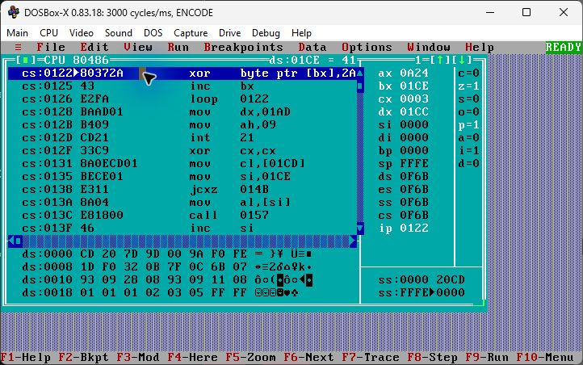
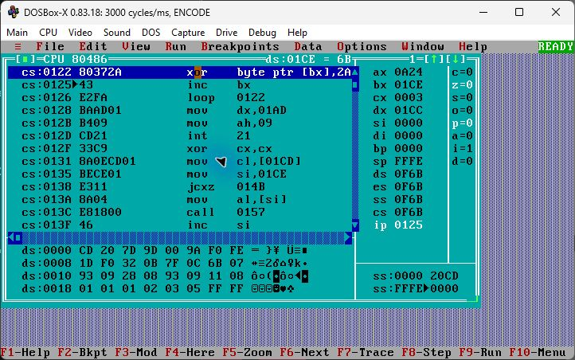

# Interactive Turbo Debugger session

Captured on 2026-10-04 with Turbo Debugger 5.0 in DOSBox-X 0.83.18.

Reference: `ENCODE.COM`, SHA-256
`2028290647ca744d2aea1ee810f812f5e9b91cbb8512f2c10ab7e108b28fa1af`.

`ABC` was entered through the keyboard. The original DOS `INT 21h/AH=0Ah`
input call executed. An enabled breakpoint stopped at `CS:0122h`; **F7**
executed one XOR instruction. The XOR row was selected again afterward to
refresh Turbo Debugger's operand display without executing another instruction.

| Value | Before XOR | After one F7 step |
| --- | --- | --- |
| CS:IP | 0F6B:0122 | 0F6B:0125 |
| DS | 0F6B | 0F6B |
| AX | 0A24 | 0A24 |
| BX | 01CE | 01CE |
| CX | 0003 | 0003 |
| DX | 01CC | 01CC |
| Byte at DS:01CE | 41 | 6B |

These values were read from the actual debugger screens. The snapshots show
an in-place memory change; the input pointer and loop count have not advanced
yet. Runtime segment allocation can differ on another launch.

Before stepping:

After one XOR step, with the operand display refreshed:

[Transcribed register evidence](turbo-session.json).
Follow [the demonstration](../../demo/README.md) to repeat the keyboard-driven
session. The separate [automated traces](debugger-results.md) use a disclosed,
seeded input setup and also check loop completion and the empty-input branch.
